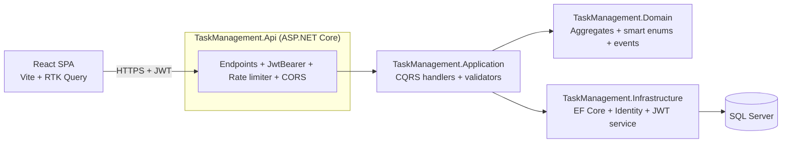
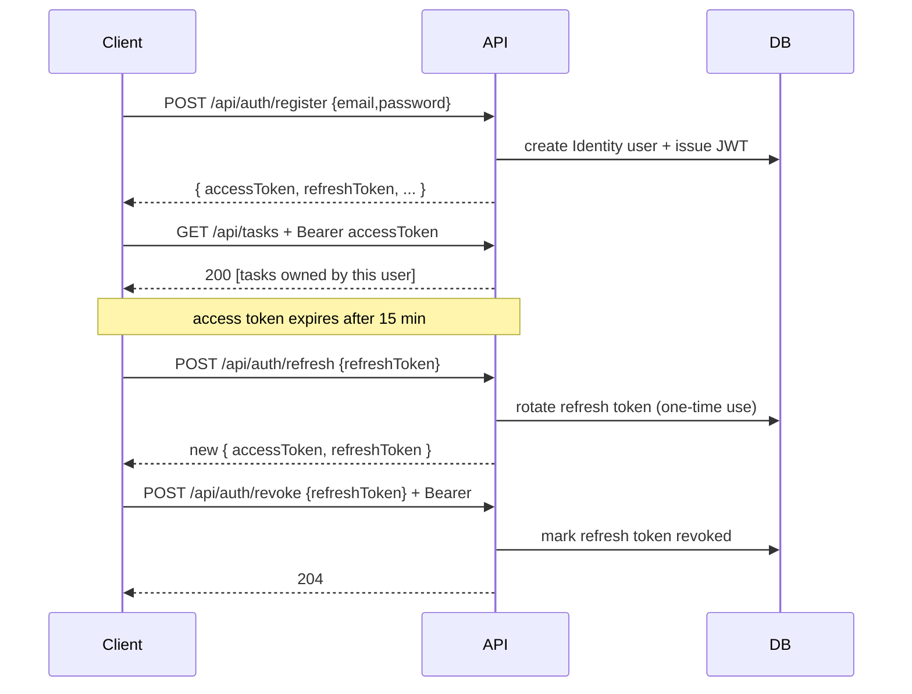

# Task Management System

Full-stack task manager built for the ICON Studios full-stack trial. .NET 8 Clean Architecture backend + React 19 SPA. JWT auth, drag-and-drop reordering, tags, full test pyramid, containerised end-to-end, deployed to Azure on the permanent free tier.

---

## Live demo

Hosted on Azure Container Apps + Azure SQL Database (free offer). Pre-seeded with a demo user and a realistic dataset (~60 tasks, 15 tags, varied statuses / priorities / due dates).

- **App**: _see the deployed URL in the submission email_
- **Demo credentials**: `demo@icon.mt` / `Passw0rd!`

First hit after idle wakes the API (~3–5 s) and SQL (~10–30 s). Subsequent requests are instant. Deployment infrastructure — Bicep + walkthrough — lives in [`deploy/azure/`](deploy/azure/AZURE.md).

---

## Highlights

### Backend (.NET 8)

- **.NET 8 LTS**, C# 12, ASP.NET Core Minimal APIs with an `IEndpoint` group pattern
- **Clean Architecture** in four projects: Domain → Application → Infrastructure → Api
- **Domain-Driven Design** tactical patterns: aggregate root, strongly-typed IDs, smart enums, domain events, domain errors
- **CQRS** with source-generated [`Mediator`](https://github.com/martinothamar/Mediator) (see ADR 0002)
- **Result pattern** via [`ErrorOr`](https://github.com/amantinband/error-or) — no exceptions for expected failures
- **JWT bearer auth** with **ASP.NET Core Identity** + rotating refresh tokens, surfaced through CQRS commands (see ADR 0003)
- **Per-user task ownership** — every task is scoped to its creator; cross-user access returns 404
- **Tags** — second aggregate with full CRUD, many-to-many association to tasks, filter by tag, cascading cleanup on delete (see ADR 0006)
- **Drag-and-drop ordering** — decimal `OrderKey` with midpoint-insert algorithm, `PATCH /api/tasks/{id}/reorder`, rebalance when keys collapse
- **FluentValidation** pipeline behavior running before every handler
- **EF Core 8** with SQL Server; migrations run automatically on container startup behind a config flag
- **Serilog** structured logging (console + rolling file)
- **Swagger UI** at `/swagger` and **Scalar UI** at `/scalar/v1` in development; `/openapi/v1.json` for the raw spec
- **RFC 7807 ProblemDetails** for every error response, uniform shape
- **Security hardening:** CORS named policy, built-in rate limiter, security headers (`NetEscapades`), HTTPS redirect + HSTS outside Development
- **Health checks** at `/health` (liveness) and `/health/ready` (DB ping) — deliberately excluded from OpenAPI
- **Tests:** xUnit + Shouldly + NSubstitute + Testcontainers.MsSql + NetArchTest + Reqnroll (105 tests)
- **Containerised:** `docker compose up --build` spins up SQL Server + API end-to-end (image ~236 MB on `jammy-chiseled-extra`)
- **CI:** GitHub Actions workflow (restore → build → test → Docker build) + weekly CodeQL security scan (C# + JS/TS)
- **Central Package Management** + **Warnings-as-errors** + SonarAnalyzer + StyleCop

### Frontend (React 19)

- **Vite 7 + TypeScript** with `@tsconfig/strictest`, React Compiler enabled
- **Redux Toolkit 2.x + RTK Query** — Redux as the brief asks for; RTK Query handles server state (caching, invalidation, refetch-on-focus)
- **React Router v7** (library mode) + `<ProtectedRoute>` with silent refresh on bootstrap
- **Auth** — access token in memory (Redux), rotating refresh token in localStorage, mutex-guarded re-auth on 401 (see ADR 0008)
- **React Hook Form + Zod** forms; Zod schemas mirror the backend FluentValidation rules
- **Tailwind CSS v4 + shadcn/ui** (Radix primitives, copy-in) — light/dark/system theme, responsive mobile filter sheet
- **@dnd-kit** drag-and-drop with keyboard support + ARIA live-region announcements (see ADR 0010)
- **RFC 7807 ProblemDetails** rendered as toasts (Sonner) or inline field errors
- **A11y day-1** — skip link, `jsx-a11y/strict`, labelled controls, visible focus, colour-contrast AA
- **Containerised** — multi-stage (node:24-slim → nginx:stable-alpine) with runtime `env.js` so one image serves every environment
- **Tests** — Vitest + RTL + MSW (unit + component) + Playwright (E2E smoke)

---

## Architecture at a glance



Dependency direction is **Api → Infrastructure → Application → Domain**, enforced at build time by architecture tests (`LayerDependencyTests`). Domain has zero external references.

### Authentication flow



---

## Project layout

```
src/                                    # .NET backend
├── TaskManagement.Domain/              # aggregates, value objects, smart enums, domain errors — no external deps
├── TaskManagement.Application/         # CQRS handlers, validators, pipeline behaviors, abstractions
├── TaskManagement.Infrastructure/      # EF Core DbContext, Identity, JWT service, repositories
└── TaskManagement.Api/                 # Minimal-API endpoints, Program.cs, auth wiring, OpenAPI
frontend/                               # React SPA (Vite + TS + RTK)
├── src/
│   ├── app/                            # store, router, providers, hooks
│   ├── features/{auth,tasks,tags}/     # feature-sliced lite (see ADR 0009)
│   ├── shared/{ui,layout,lib,hooks}/   # shadcn/ui primitives + utilities
│   └── pages/                          # NotFound, ErrorBoundary
└── tests/{unit,e2e,mocks}/             # Vitest + RTL + MSW + Playwright
tests/                                  # .NET tests
├── TaskManagement.Domain.UnitTests/        # 31 tests — aggregate invariants, smart enums
├── TaskManagement.Application.UnitTests/   # 38 tests — every handler + validators
├── TaskManagement.Api.IntegrationTests/    # 27 xUnit + 2 Reqnroll scenarios over Testcontainers MSSQL
└── TaskManagement.ArchitectureTests/       # 7 rules — Clean Architecture layering
docs/
├── adr/                                # 10 architecture decision records
└── api.http                            # REST Client smoke script
```

---

## Quickstart

### Prerequisites

- .NET 8 SDK (≥ 8.0.400). `global.json` pins the SDK band.
- Docker Desktop (for SQL Server + integration tests + full-stack compose)

### Option A — Run the full stack in Docker (recommended)

```bash
cp .env.example .env
# edit .env → set JWT_SECRET_KEY to a fresh 32+ char value
docker compose up -d --build
```

- **SPA:** <http://localhost:5173>
- **API:** <http://localhost:8080>
- **Swagger:** <http://localhost:8080/swagger> (only in Development — set `ASPNETCORE_ENVIRONMENT=Development` in `docker-compose.yml` to try it)
- **SQL Server:** `localhost:1433` (`sa` / value of `SA_PASSWORD`)

Migrations run automatically on container startup via the Polly-wrapped `DbContext.MigrateAsync()` call (flag: `Database__RunMigrationsOnStartup=true` in the compose env). The SPA writes its runtime `env.js` at container start from `FRONTEND_API_BASE_URL`, so one image serves every environment.

### Option B — Run the API on the host (hot reload, Swagger on)

```bash
# 1. Start SQL Server
cp .env.example .env
docker compose up -d sqlserver

# 2. Store secrets in user-secrets (they are never committed)
dotnet user-secrets --project src/TaskManagement.Api init
dotnet user-secrets --project src/TaskManagement.Api set "Jwt:SecretKey" "<at-least-32-chars>"

# 3. Apply migrations
dotnet tool restore
dotnet ef database update --project src/TaskManagement.Infrastructure --startup-project src/TaskManagement.Api

# 4. Run the API
dotnet run --project src/TaskManagement.Api
```

Swagger will be at the URL printed in the console (e.g. `http://localhost:5048/swagger`). Click **Authorize** and paste the `accessToken` from `/api/auth/login`.

### Option C — Run the React SPA on the host against a local API

```bash
# 1. Start the API (either Option A or Option B above so http://localhost:8080 is live)

# 2. Start the SPA
cd frontend
corepack enable                         # one-off; provides pnpm@10
pnpm install
pnpm dev                                # → http://localhost:5173
```

The dev server proxies nothing; it calls the API directly on `http://localhost:8080`. CORS is pre-configured (`appsettings.json` → `Cors:Origins` already includes `http://localhost:5173`). Register a new user in the UI and you're off.

### Run tests

```bash
# Backend — everything (requires Docker for the integration-test MSSQL container)
dotnet test

# Backend — only unit + architecture tests (no Docker)
dotnet test tests/TaskManagement.Domain.UnitTests
dotnet test tests/TaskManagement.Application.UnitTests
dotnet test tests/TaskManagement.ArchitectureTests

# Frontend — unit + component tests (no Docker, no live backend)
cd frontend && pnpm test:run

# Frontend — E2E smoke (needs the API running)
cd frontend && pnpm test:e2e:install && pnpm test:e2e
```

---

## Endpoints

### Auth

| Method | Route                  | Auth required | Description                                             |
|--------|------------------------|---------------|---------------------------------------------------------|
| POST   | `/api/auth/register`   | No            | Create an account; returns access + refresh tokens      |
| POST   | `/api/auth/login`      | No            | Exchange email + password for access + refresh tokens   |
| POST   | `/api/auth/refresh`    | No            | Rotate refresh token — old token is revoked             |
| POST   | `/api/auth/revoke`     | Yes           | Revoke a refresh token (logout)                         |

### Tasks (all require `Authorization: Bearer <accessToken>`)

| Method | Route                             | Description                                             |
|--------|-----------------------------------|---------------------------------------------------------|
| GET    | `/api/tasks`                      | List current user's tasks. Query: `status`, `priority`, `search`, `sortBy`, `sortDirection`, `page`, `pageSize` |
| GET    | `/api/tasks/{id}`                 | Fetch one task by id (404 if not owned by caller)       |
| POST   | `/api/tasks`                      | Create a task — `OwnerId` is set from the JWT `sub`     |
| PUT    | `/api/tasks/{id}`                 | Update title, description, priority, due date           |
| DELETE | `/api/tasks/{id}`                 | Delete a task permanently                               |
| PATCH  | `/api/tasks/{id}/complete`        | Mark a task as completed                                |
| PATCH  | `/api/tasks/{id}/reopen`          | Reopen a completed task back to Pending                 |

### Operational

| Method | Route              | Description                            |
|--------|--------------------|----------------------------------------|
| GET    | `/health`          | Liveness probe                         |
| GET    | `/health/ready`    | Readiness probe (DB reachable)         |

### Sample flow

```http
POST /api/auth/register
Content-Type: application/json

{ "email": "demo@icon.mt", "password": "Passw0rd!" }

→ 200 { "accessToken": "eyJ…", "refreshToken": "…", "accessTokenExpiresUtc": "…" }

POST /api/tasks
Authorization: Bearer eyJ…
Content-Type: application/json

{ "title": "Ship Task Management v1", "priority": "High", "dueDateUtc": "2026-05-01T00:00:00Z" }

→ 201  + Location: /api/tasks/{id}
```

Validation failures return 400 with a ProblemDetails payload. Not found → 404. Business rule violations (e.g. completing an already-completed task) → 409 Conflict. Unauthenticated → 401. Cross-user access → 404 (don't leak existence).

See [`docs/api.http`](docs/api.http) for a ready-to-run REST Client script covering every endpoint.

---

## Security posture

| Concern                     | How it's handled                                                                                   |
|-----------------------------|----------------------------------------------------------------------------------------------------|
| Authentication              | ASP.NET Core Identity (EF store) for password hashing + lockout; custom HS256 JWT issuance         |
| Authorization               | `.RequireAuthorization()` on the `/api/tasks` group + `/api/auth/revoke`; ownership checks in handlers |
| Session revocation          | Refresh tokens stored hashed, one-time use, rotate on `/refresh`, marked revoked on `/revoke`      |
| Password policy             | 8+ chars, upper + lower + digit (FluentValidation)                                                 |
| Brute force                 | Identity lockout — 5 failed attempts → 5 minute lockout                                            |
| CORS                        | Named `SpaCors` policy, origins from `Cors:Origins` config array, credentials allowed              |
| Rate limiting               | Built-in ASP.NET Core 8 limiter: 100 req/min per IP globally, token bucket on `/auth/*`            |
| HTTPS                       | `UseHttpsRedirection()` + `UseHsts()` outside Development                                          |
| Security headers            | `NetEscapades.AspNetCore.SecurityHeaders` — frame-deny, no-sniff, referrer-policy, permissions-policy |
| Secrets                     | Never in source: `dotnet user-secrets` locally, `.env` → compose env vars in containers, CI secrets |
| CodeQL                      | Weekly scheduled C# security scan (`.github/workflows/codeql.yml`)                                 |

---

## CI / CD readiness

The [GitHub Actions workflow](.github/workflows/ci.yml) runs two parallel jobs on every push and PR against `main`:

**Backend job:**

1. Restore (cached by `**/*.csproj` hash)
2. Build Release with warnings-as-errors
3. Run all four test projects (integration tests use host Docker on `ubuntu-latest`)
4. Upload `.trx` test results + Cobertura coverage as artefacts
5. Build the API Docker image (tagged with commit SHA)

**Frontend job:**

1. Install pnpm + Node (cached by `pnpm-lock.yaml`)
2. Lint (ESLint 9 flat, `--max-warnings=0`)
3. Typecheck (`tsc -b --noEmit`)
4. Unit + component tests with coverage
5. Production build
6. Build the SPA Docker image (tagged with commit SHA)

Neither job pushes images — flip `push: false` + registry login when a registry is wired up.

**CodeQL** runs a separate weekly workflow scanning **both C# and JavaScript/TypeScript** with the `security-and-quality` query pack.

The job description mentions **Azure DevOps** as an asset; the equivalent `azure-pipelines.yml` would mirror the same shape with `DotNetCoreCLI@2` + `Docker@2` tasks. No functional difference.

**Gitflow-ready** — the repo is initialised on `main`. `develop` is a one-liner away (`git checkout -b develop`) when team work starts.

---

## Testing philosophy

- **Unit tests** cover the domain aggregate and every handler. Handlers use EF Core InMemory for speed while still exercising the real LINQ translator.
- **Architecture tests** use NetArchTest to enforce Clean Architecture layering + handler naming/sealing rules at build time.
- **Integration tests** spin up a real SQL Server via Testcontainers, apply migrations, register users, mint JWTs, and exercise the full HTTP pipeline through `WebApplicationFactory`. Respawn resets state between tests.
- **Acceptance tests (Reqnroll / Gherkin)** live alongside the integration suite in `tests/TaskManagement.Api.IntegrationTests/Acceptance`. One `.feature` file narrates the authenticated task lifecycle end-to-end; step bindings share the Testcontainers factory via Reqnroll's `[BeforeTestRun]` hook. Reqnroll is the 2026 successor to SpecFlow.
- **DI container validation test** resolves the core abstractions from a fresh scope — a regression guard against scoped-vs-singleton lifetime bugs that would otherwise only surface on the first real HTTP request.
- **Ownership isolation test** — user A creates a task, user B sees 404 on every mutation path. Belt-and-braces against the `OwnerId` filter being forgotten in a future handler.

---

## Package choice rationale (2026)

The .NET OSS landscape shifted around 2024. Several previously-free libraries became commercial. This project deliberately picks free, actively-maintained alternatives:

| Use case        | This project                            | Why not the classic option |
|-----------------|-----------------------------------------|----------------------------|
| Mediator        | `Mediator` (martinothamar)              | MediatR v13+ requires a commercial license |
| Assertions      | `Shouldly`                              | FluentAssertions v7+ went commercial |
| Mocking         | `NSubstitute`                           | Moq had the SponsorLink controversy (2023) |
| Mapping         | `Mapster`                               | AutoMapper v14+ went commercial |
| Result pattern  | `ErrorOr`                               | MIT, lightweight |
| OpenAPI UI      | `Scalar.AspNetCore` **+ Swagger UI**    | Scalar renders beautifully; Swagger UI kept because the brief asks for "Swagger" |
| Security headers| `NetEscapades.AspNetCore.SecurityHeaders` | NWebSec is effectively unmaintained in 2026 |

---

## Bonus points checklist (from the trial brief)

Mapping each bullet from the "Bonus Points" list in `Full Stack Trial.pdf` to what's implemented:

| Bonus bullet              | Status         | Where                                                                 |
|---------------------------|----------------|-----------------------------------------------------------------------|
| Unit tests                | ✅             | 100+ .NET tests (domain, application, architecture, integration) + 20 frontend tests (Vitest + RTL + MSW) |
| Task prioritisation       | ✅             | `TaskPriority` smart enum (Low/Medium/High/Critical) + UI filter + sort + coloured badges |
| Drag-and-drop sorting     | ✅             | Backend: `OrderKey` + `PATCH /api/tasks/{id}/reorder`. Frontend: `@dnd-kit` with keyboard support + optimistic cache patches (see ADR 0010) |
| Authentication            | ✅             | JWT bearer + rotating refresh tokens (Identity) on the server; access-token-in-memory + localStorage-refresh + mutex reauth on the client (see ADR 0008) |
| Containerisation          | ✅             | Both services multi-stage (`jammy-chiseled-extra` API, `node:24 → nginx:stable-alpine` SPA with runtime `env.js` injection). Full `docker compose up` brings up SQL + API + SPA |
| Deployment readiness      | ✅             | Live on Azure (Container Apps + SQL DB Free Offer + Log Analytics) via Bicep in [`deploy/azure/`](deploy/azure/). GitHub Actions push images to GHCR on `main`; `deploy.yml` rolls new revisions. Demo data seeded on startup. |
| Responsive UI             | ✅             | Tailwind breakpoints, mobile `<Sheet>` filter panel, hamburger account menu, theme toggle (light/dark/system) |
| "Advanced functionality"  | ✅             | **Tags** (second aggregate + tag picker combobox + tag manager modal), **CQRS** via Mediator, **Clean Architecture / DDD**, per-user ownership returning 404 (not 403), rate limiting, security headers, RFC 7807 surfaced as toasts + inline field errors, Testcontainers, NetArchTest, CodeQL (C# + JS/TS) |

---

## Deployment

### Live (Azure, free tier)

Deployment infrastructure is in [`deploy/azure/`](deploy/azure/). [`AZURE.md`](deploy/azure/AZURE.md) walks through the full flow from a fresh Azure account to a public URL.

Key choices:

- **Azure Container Apps** for the API and SPA — Consumption plan, scale-to-zero, covered by the monthly free grant (180K vCPU-s + 360K GiB-s + 2M req per subscription).
- **Azure SQL Database Free Offer** — 100K vCore-seconds serverless GP + 32 GB storage, free forever on a subscription. Auto-pauses after 1 h idle; `freeLimitExhaustionBehavior: AutoPause` means billing never accrues past zero.
- **Log Analytics** — 5 GB ingestion/month free, required wiring for Container Apps diagnostics.

Everything is a single `main.bicep` + a `deploy.sh` wrapper. `.github/workflows/deploy.yml` picks up the same template on a successful CI run against `main` and rolls a new revision.

### CI → registry

`.github/workflows/ci.yml` builds both images on every push. On pushes to `main` (or tag refs) it additionally pushes to `ghcr.io/<owner>/<repo>/{api,frontend}` with tags `:latest`, `:<sha>`, and `:<tag>` where applicable. PRs build only — no push.

### Demo seeding

`Seeding__DemoData=true` triggers [`DemoDataSeeder`](src/TaskManagement.Infrastructure/Persistence/DemoDataSeeder.cs) after migrations. It creates the `demo@icon.mt` user (password `Passw0rd!`), 15 curated tags, and 60 tasks generated with [Bogus](https://github.com/bchavez/Bogus) using a fixed seed — statuses, priorities, due dates (some overdue, some upcoming), and 0–3 tags per task. Idempotent: won't double-seed on restart.

---

## What's next (future iterations)

- **HttpOnly-cookie refresh tokens** — backend sets the cookie on `/login`/`/register`/`/refresh`, SPA drops `tokenStorage.ts`. Flagged in ADR 0008; a coordinated change across both halves
- **Role-based authorization** — hook already in place (`IdentityRole<Guid>` is in the context); add roles + `[Authorize(Roles = "Admin")]` when needed
- **Email confirmation / password reset** — Identity token providers can be wired up; needs an SMTP sender
- **Observability** — Serilog sinks to OpenTelemetry or Application Insights; frontend error reporting (Sentry or equivalent)
- **Real-time updates** — SignalR / WebSockets when collaboration lands; for now RTK Query's refetch-on-focus is enough

---

## Troubleshooting

- **"Connection string 'Database' is not configured"** — either start `docker compose up -d sqlserver`, or set `ConnectionStrings__Database` via user-secrets / env var.
- **`Jwt:SecretKey must be at least 32 characters`** on startup — the `Jwt:SecretKey` config value is missing or too short; `Options.ValidateDataAnnotations` is correctly refusing to start.
- **EF tools not found** — `dotnet tool restore` once after cloning.
- **Integration tests hang** — Docker Desktop must be running for Testcontainers.
- **`Globalization Invariant Mode is not supported`** — only happens if you swap the Docker base image from `jammy-chiseled-extra` to plain `-chiseled`. SqlClient needs ICU; stick with the `-extra` variant (see ADR 0005).
- **SQL Server container fails on Apple Silicon** — use `azure-sql-edge` instead of `mssql/server`; swap in `docker-compose.yml`.
